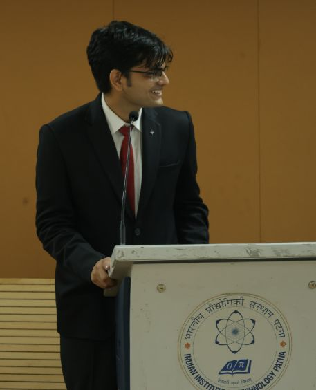

<!--  -->

Concluding my tenure as the Undergraduate Representative for the AY 2024-2025 at Students' Gymkhana, IIT Patna. I am immensely proud of what we, the Academic and Career Council (ACC UG), have achieved.

A brief breakdown:

1. **6 Month Internships Approved** in IIT Patna.
2. **Roll out of Minor Degree Courses.**
3. Troubleshooting various concerns with regards to curriculum and academic procedures.
4. Solving a long-standing issue with regards to delayed results and consolidated transcripts, courtesy of fixes implemented through collaboration between Moodle and Academic Section, IIT Patna.
5. Formalization and establishment of Research Community, conduction of Research Conclave.
6. (TBA) Development of an entirely new site for IIT Patna, with massive help from the STC Dev Team.
7. Organization of Farewell events (Yearbook '25) ranging from Sports to Cultural activities, with due credits to the Yearbook Design team, Sports Council, HoSCA and its coordinators.
8. Enhancing student experience through:
   - Securing Entire Central Lecture Hall for students during exams to overcome library constraints.
   - Documentation of Academic Procedures through a comprehensive site and the "ACC Survival Guide"
   - Assisting with Scholarships both in-house and through collaboration with NGOs.
9. **Strengthening Student-Faculty Dialogue:**  
   - Regular open forums and feedback sessions with students and faculty to address academic and campus life issues.
   - Initiated monthly "Ask the ACC" sessions for transparent communication.
10. **Academic Policy Reforms:**  
    - Advocated for flexible credit transfer and course withdrawal policies.
    - Streamlined the process for academic grievances and redressal.
11. **Support for Research & Innovation:**  
    - Facilitated workshops on research methodology and grant writing.
    - Launched a mentorship program pairing UG students with research scholars and faculty.
12. **Mental Health & Wellbeing Initiatives:**  
    - Collaborated with the Counselling Cell to organize stress management and mental health awareness events.
    - Helped set up a peer support network for students.
13. **Digital Transformation:**  
    - Pushed for digitization of academic records and online application systems for scholarships and internships.
    - Oversaw the launch of the new ACC portal for centralized student resources.
14. **Inclusivity & Outreach:**  
    - Supported initiatives for first-generation college students and students from underrepresented backgrounds.
    - Organized orientation programs and Q&A sessions for incoming batches.

These milestones were truly a team effort. A massive thank you to the VP Gymkhana Shubham Satyam; fellow Gymkhana Core Members Kirtan Jain, Ankit Kumar, Shivam Kumar Dubey, Suryansh Bansal, Soureesh T V S S and all the passionate Members of the Academic and Career Council (ACC) – Rishabh Raunak, Aditya Yadav, Ruchi Chand Thakur, and Hemanth Kumar Katariya, the wider Gymkhana family and Deans, Faculties and Staff who assisted me throughout these endeavours.

I wish all the best to the upcoming UGR Yash Raj to continue the momentum and all Juniors who I hope will take whatever amount of effort is required to leave this #IIT in a better place than we found it.

---

*Thank you, IIT Patna, for the opportunity and trust. The journey has been transformative, and I look forward to seeing the institute and its students reach even greater heights!*

