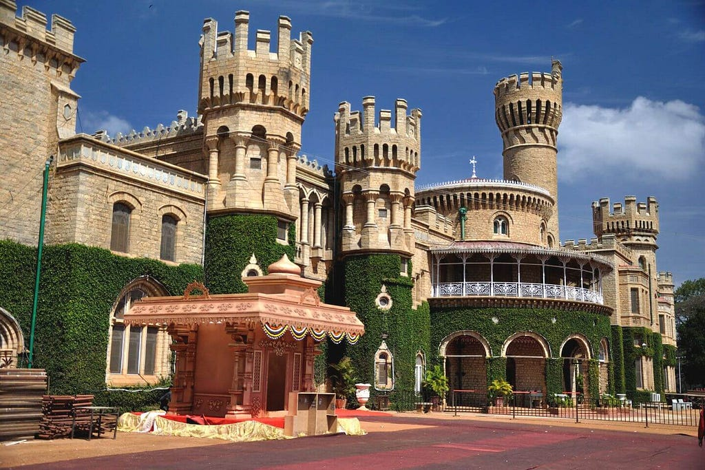
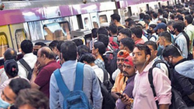

In Noida, once green farmlands now succumb to the relentless stretches of concrete.

My longstanding distaste for the urban ways are more apparent here, a stark contrast to Bangalore’s vibrant blend of old-world charm and modernity. From Kempegowda’s ancient fort to the bustling IT hub, each corner brims with history, culture, and diversity.
<figure><figcaption>Bangalore Palace</figcaption></figure>
Yet, Noida presents a jarring sight, its skyline dominated by endless skyscrapers completed within a mere decade, each a testament to rapid development.

Every 400 meters, a mall or shopping complex looms, while recreational spaces fade into the concrete expanse. I yearn for the simplicity of park strolls and neighbourly camaraderie, drowned out by the ceaseless hum of consumerism. This generation for some reason associates recreation with something that needs them to consume.

The soul of Noida, if it ever existed, now lies buried beneath the rush of daily life. Its lack of identity, history, or culture is sickening. Can one even recall a distinctive dialect or cuisine associated with this place? And so is the individuality of people working here lost.
<figure><figcaption>Noida Metro</figcaption></figure>
Disembarking the metro, I witness a frenzied race against an invisible foe. Why do people sprint homeward when autos await patiently? What drives this relentless pursuit?

I come across so many graduates from IIT here, regardless the sight of myself blending into this crowd churns my stomach. Interning among peers handpicked on campus from a particular IIT, I initially embraced the challenge as a competition. Yet, as I exhaust myself to outshine them which I’ve done extremely well so far, I question the purpose of this relentless pursuit. Am I merely replicating the rat race I once feared?

It’s not only Noida that I speak of, but all Urban centres, where people live a life dictated by their corporates, Noida has only made it more apparent to me, what I hate and what I fear. This city had it all laid bare

And what of those around me? Are they too ensnared in this pursuit of success, oblivious to the emptiness it brings?

