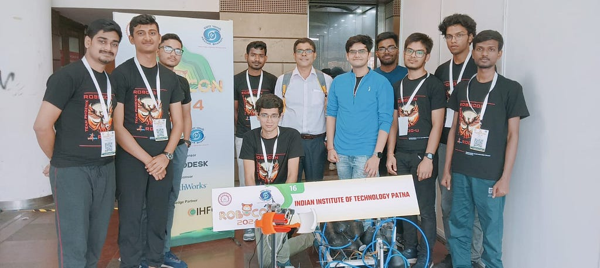

<figure>
  
  <figcaption>Me, Atul Sir (middle) and The Robocon Team of IIT Patna at the National Finals</figcaption>
</figure>

  <a 
    href="https://panav.gitbook.io/robotics-handbook" 
    class="underline text-blue-600 hover:text-blue-800 visited:text-purple-600"
    target="_blank"
    rel="noopener noreferrer"
  >
    Welcome to the Ultimate Robotics Handbook | Robotics Handbook
  </a>

The spark for a full-fledged, hosted guide on robotics and its intricate concepts ignited when a few juniors approached me, searching for resources. As someone who once navigated the steep learning curve of robotics with limited guidance, their questions resonated deeply.

This is more than just a collection of information; it’s a mission to simplify knowledge transfer and help a new generation — both within the walls of IIT Patna and far beyond — to confidently get to grips with the fascinating world of robotics without getting lost in the often-overwhelming sea of information.

This endeavor wouldn’t have been possible without the foundational knowledge and lecture materials of Atul Sir, whose expertise has particularly shaped the Kinematics section. I’m also incredibly grateful to Yuvaraj Sir, the members of the BRAIn Lab, and the entire Robocon Team for their invaluable proofreading and support.

### Welcome to The Ultimate Robotics Handbook!

<picture>
  <source srcset="/medium/1m_UrHOU7ig-4mxuBW0EILw.gif" type="image/gif">
  
</picture>

This is your launchpad into the future of intelligent machines. We’ve designed this comprehensive guide to demystify robotics and accelerate your learning journey. Whether you’re taking your first steps or looking to delve into more advanced topics, this handbook aims to cover it all.

Explore the world of robotics with insights into:

- **Fundamentals & Advanced Topics:** From the core principles of robotics engineering to complex areas like robotics automation, AI integration, control systems, and the Robot Operating System (ROS) [5](https://www.wevolver.com/article/what-is-robotics-a-comprehensive-guide-to-its-engineering-principles-and-applications)[9](https://techhq.com/2022/11/user-manual-on-robotics/).
- **Practical Learning:** Step-by-step breakdowns of robotics concepts, covering everything from mathematical foundations like Linear Algebra and Calculus to programming, embedded systems, microcontrollers, sensors, and actuators.
- **Hardware & Design:** Understanding hardware, fabrication parts, common mechanisms, 3D modelling (CAD), simulations, and PCB design.
- **Specialized Fields:** Delve into ML and Perception (including Reinforcement Learning, Computer Vision with OpenCV), Mobile Robotics (SLAM, Kinematics, Trajectory Planning), and emerging frontiers like Humanoids and Autonomous Navigation.
- **Real-World Applications & Careers:** Discover real-world applications in industry and research. We’ve also curated information on career paths, in-demand robotics skills, job roles, top robotics companies hiring, and leading research institutes pioneering the future [5](https://www.wevolver.com/article/what-is-robotics-a-comprehensive-guide-to-its-engineering-principles-and-applications).

This handbook is for the curious student, the passionate enthusiast, and the aspiring professional.

This handbook is a living document, one that I hope will grow and evolve with the field of robotics itself. It’s a testament to the passion that drives innovation and the belief that knowledge, when shared, can empower countless individuals to build an amazing future.
